# Hello everybody!
Welcome to the second update of 2019 for BarCamp Events! We've got some exciting stuff to share: BarCamp Omaha updates (including the groovy design!), exciting "day of" happenings at BarCamp Omaha, the BarCamp app updates, and our new sponsors and backers. Let's get into it!

# BarCamp Omaha
BarCamp Omaha is happening November 9th, at Kaneko. Buy your tickets here: https://www.eventbrite.com/e/barcamp-omaha-2019-tickets-66366823957

#### Leading up to the event
A few exciting things have happened since our last update - BarCamp Omaha 2019's branding went live - Thanks to the bones! Check out their redesigned site: https://www.thebonesco.com

The theme for 2019 is friendship - because without our friends in our community, BarCamp Omaha may not have come back.

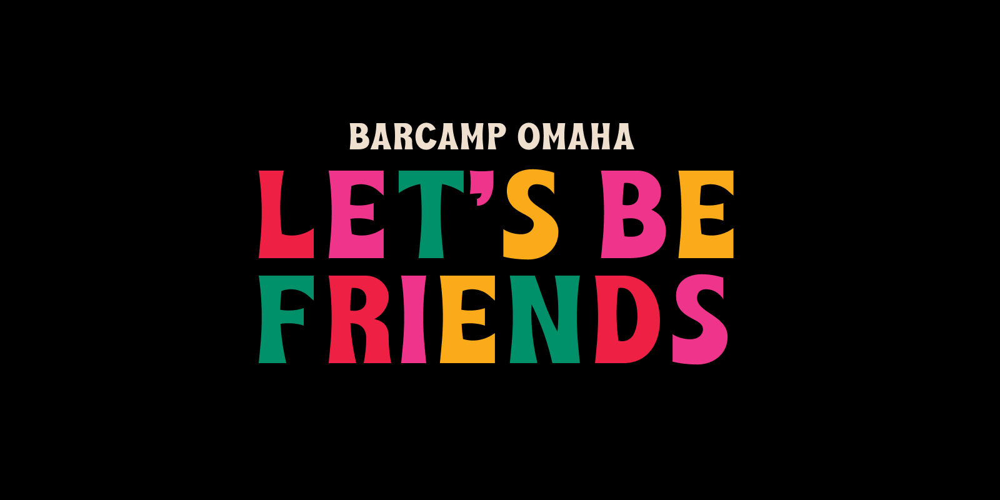
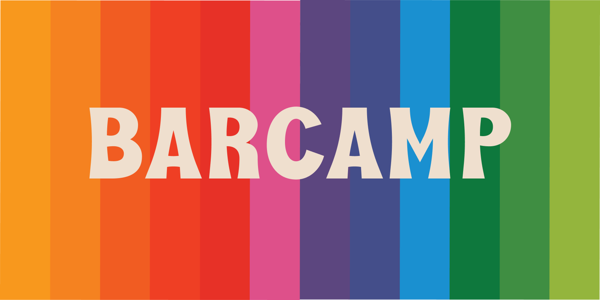
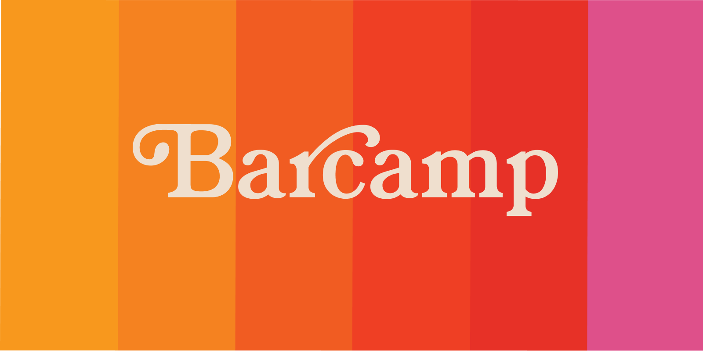
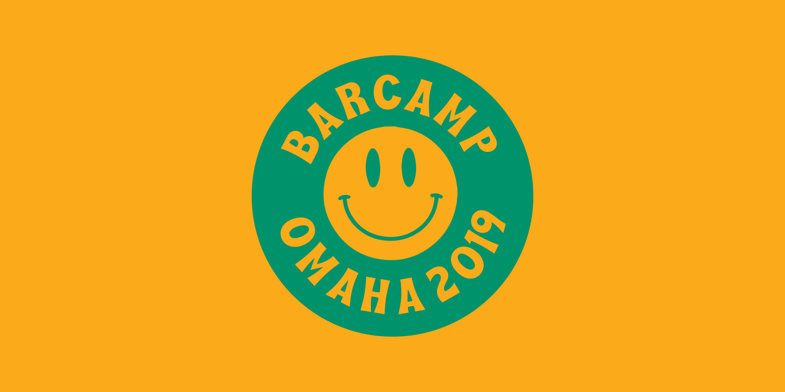

Thanks to Bergman Incentives, a Gold Sponsor, we're going to have some colorful friendship bracelets for all attendees (or until we run out - then I'll make yours myself!)

I sent the check for Kaneko this morning! WHEW! I also sent about half of my planned sponsorship emails, so I have more on that front to do. Also, I have sent many people their Eventbrite code to buy their free tickets, and I'll have another round of those going out quite soon!

Speaking of ticket sales, we've sold 25 tickets since our last update!

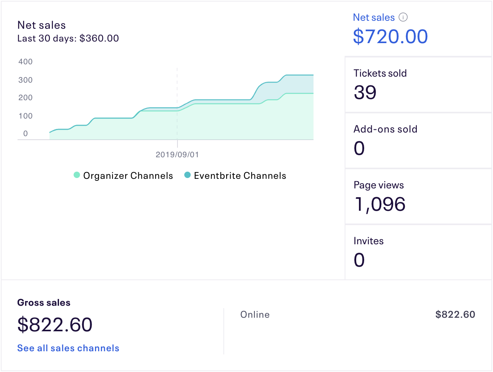

I'm staying late today to prep a site for 2019. I want to have the design ready by this weekend, that would be pretty awesome.

But, why not relive what brought us here? When all the barcamp material was transferred to me, I also received the past sites. So, here it is, your moment of zen - all of the BarCamp Omaha sites since 2014:

https://2014.barcampomaha.org (Design by Grain & Mortar: https://grainandmortar.com/)
https://birdhunt.barcampomaha.org (Design by Grain & Mortar)
https://2015.barcampomaha.org (Design by Round & Round: https://www.roundandround.co/)
https://2016.barcampomaha.org (Design by Fruitful: https://www.fruitful.design)

#### Day of Updates
A few fun things: I'm setting up a place where my partner, Gabriella Parsons (https://www.gabriellaparsons.com/), is going to have an area set up at BarCamp Omaha where she will be interviewing attendees. Aside from that, I have a few more things being cooked up that I'll share in the next update! I'll be giving one talk about the direction I'm taking BarCamp Omaha and how you can organize or art direct any event. More to come - this coming month is all about "day-of"

# BarCamp Events
I'm going to reiterate this until everybody knows: BarCamp Events is the tent-pole organization that will help us continue putting on BarCamp Omaha effectively, as well as (hopefully!) other BarCamp's in the area and beyond. Tangentially, the BarCamp Event's app helps people organize their own BarCamp-like event.

#### Design
BarCamp Events finally has a settled design language, which might only make minor shifts as everything is settling in. Check it out! The wavelengths behind are a quick and dirty representation of the sound of multiple talks given at onces - definitely a very barcamp day-of type vibe! It's not perfect, but it's what it needs to be, so that's great.

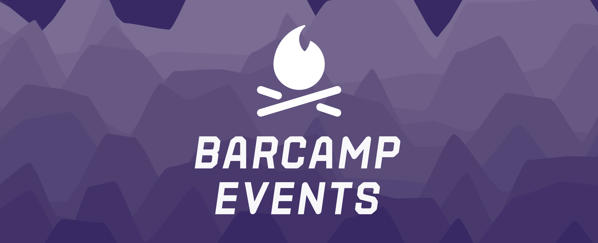

#### App Progress
I'm working on the app a bit or a lot every day. You can check out the progress by going here: https://beta.barcamp.events. This app will be usable before BarCamp Omaha, and it's here that we'll put together the schedule for the day of the event. I'll be sending out invites to folks at least a couple weeks before November 9th. It's already quite feature filled - you can sign up, in, out, create events, add/remove sponsors, tracks, and talks to/from events. I would say, conservatively, it's about 20% done and I'll have people run through using it when it's at about 50% or so. The parts that are missing are the entire "hosting" experience, and the scheduler itself.

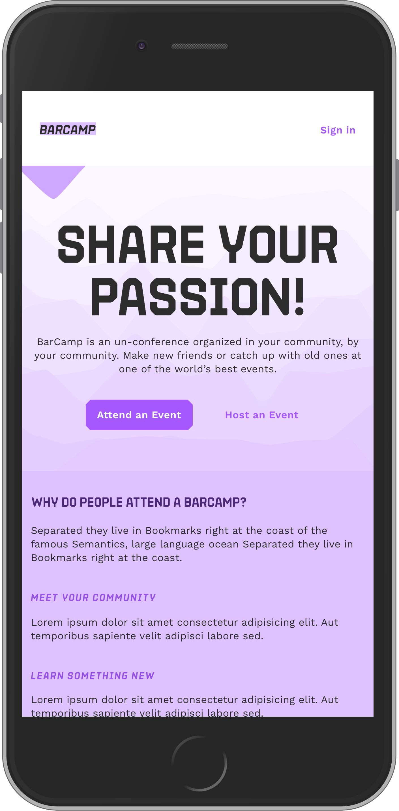
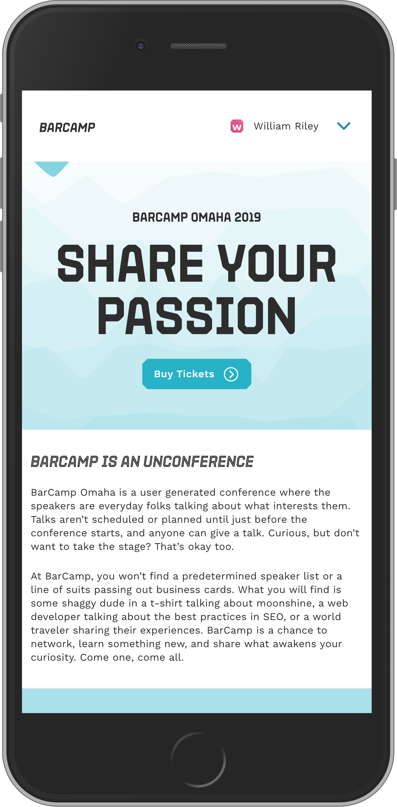
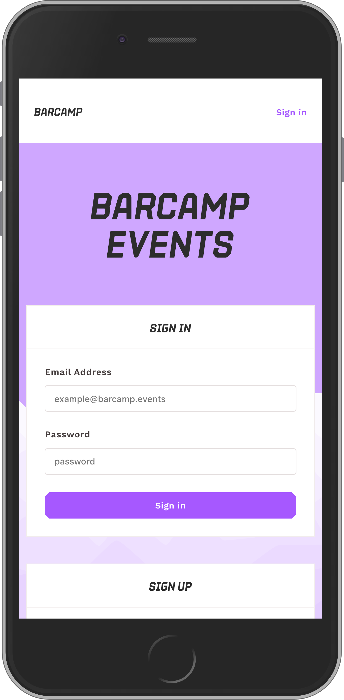
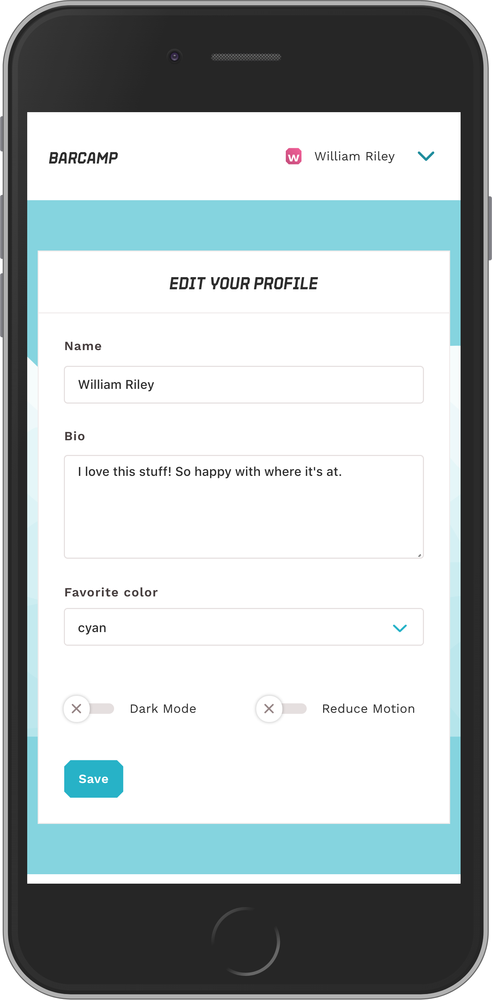
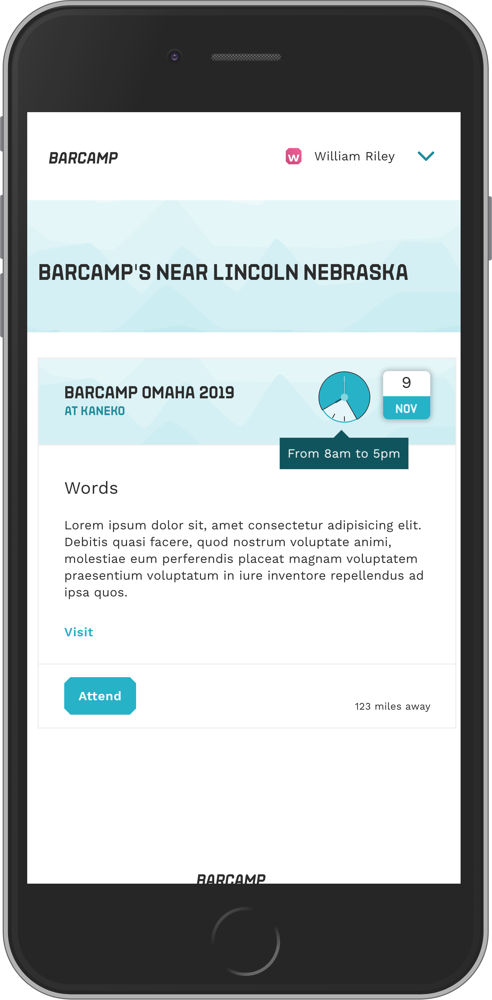

#### 501(c)(3)
This is on my agenda this month, I've done some preliminary work and I want to get this by the end of the year for BarCamp Events. There's not much else to share, but I wouldn't be doing my job if I didn't share this progress. Hopefully I will have more progress on this front in our next update.

# What you expected between August and September
- [x] __Done!__ We'll kick off sponsorship emails over the next week.
- [x] __Done!__ By the end of August, we'll have design and...
- [ ] __Not done!__ a site at barcampomaha.org, at least by mid-september.
- [x] __Check in the mail!!__ We'll pay off the Kaneko expense!
- [x] __Done!!__ send me an email if you would like to volunteer We'll send out a volunteer form!
- [x] __Half done, but never ending!__ We'll send our sponsors their free tickets!
- [x] __Design is done, and the app is coming along well!__ I might have design for the BarCamp Events site and app completed by mid september, just in time for our next open collective update!
- [x] __Lots done here, lots more to do!__ More messaging and organization.
- [x] __Done!__ Accessible here (https://github.com/barcamp-events/documents) We'll have a CoC, published and available by mid-september.

# What to expect for September/October
This next 30 days for me is all about "day-of" type stuff. I'll be securing food, drink, snacks, and track sponsorships and if the budget works, we'll have a pre-party planned out, and an invite sent to folks! I'll be sending all the sponsorship ticket.
In no particular order:
- [ ] Breakfast secured
- [ ] Lunch secured
- [ ] Snacks secured
- [ ] Inclusivity products secured
- [ ] Lots of tiny common things like banners and powerpoint designs
- [ ] The 2019 site does live
- [ ] D&I tickets are available
- [ ] (Hopefully) a pre-party venue secured
- [ ] Friendship bracelets secured
- [ ] Design, Tech, Makers, and Kitchen Sink track sponsorships secured
- [ ] The BarCamp Events app should be good to go
- [ ] More progress on the 501(c)(3)

# Thank you's
This month found us with quite a few new sponsors! A massive 🙏 thank you 🙏 to our second round of sponsors:

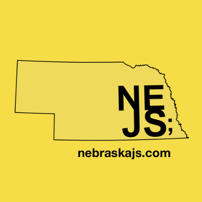

First, a HUGE thank you to NEJS Conf, NebraskaJS, and the organizers for donating well past the platinum tier last night! I'm going to catch up with them shortly and see what I can do to help. NebraskaJS and specifically the late NEJS Conf have been some of the kindest and most truely awesome groups of people Nebraska has had the opportunity to have in it's fine state. Please give them all the love you can - I know I will!

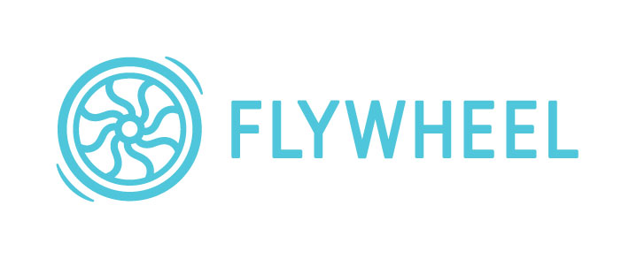

Flywheel is our first Platinum sponsor is sponsoring the Diversity and Inclusion efforts for BarCamp Omaha! This includes technology to help make the event accessible, gender pronoun stickers, folks helping to manage the incident phone line, post-event translation of recorded talks, and a D&I ticket bucket of 10 tickets to BarCamp Omaha for our community. More to share on that soon! A groovy thank you to Flywheel!

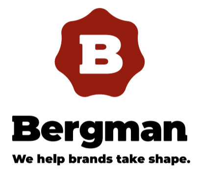

Bergman Incentives are our first Gold Sponsor, and they've donated the friendship bracelets as well as an additonal $250 that helped me send the check to Kaneko. I'm so grateful that Bergman is helping put on this new phase of BarCamp - Please give Mike Battershell and Bergman a huge thank you!

Lyconic (a true VETERAN - they have sponsored barcamp for 10 years now! Shout out to Aron and Adam!) and Aaron Shaddy who are our newest Silver Sponsors! Amanda Rucker and Sarah Schreiter Harvey who are both Bronze Sponsors. And our wonderful, amazing new recurring level Carbon Sponsors: Jay Hannah, and Matt Secoske!

All of our contributors and sponsors can be found here: https://opencollective.com/barcamp-events#contributors (and they are all beautiful people)

See you in one month!
